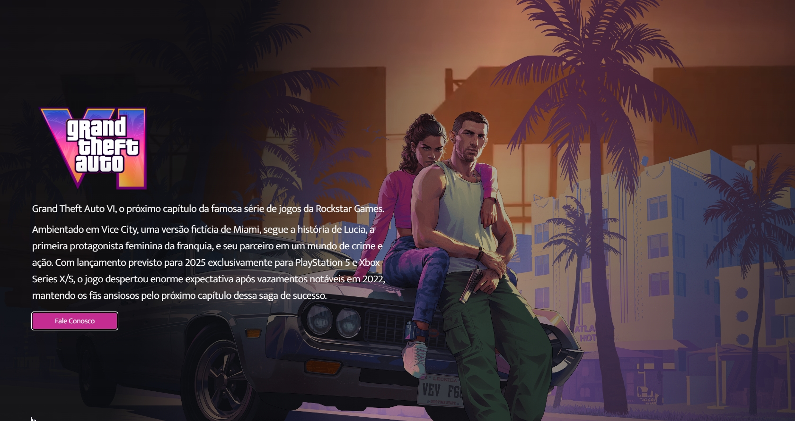

# GTA VI Single Page

Este projeto apresenta um layout minimalista com um vídeo em plano de fundo, oferecendo uma atmosfera imersiva aos visitantes. Com uma combinação de vídeo de fundo e sobreposição de imagem, o site destaca a ambientação de Vice City, a emocionante nova localização fictícia que serve como cenário para a próxima aventura da Rockstar Games.

### Deploy
Visualize o site aqui: [https://daanrox.github.io/gtavi/](https://daanrox.github.io/gtavi/)

## Tecnologias Utilizadas

O site foi desenvolvido utilizando as seguintes tecnologias:

  
  
  

Não foi utilizado nenhum framework ou biblioteca para o desenvolvimento deste projeto.

Este repositório serve como ponto de partida para a criação de um ambiente envolvente e informativo para os fãs ansiosos pelo próximo capítulo da renomada série Grand Theft Auto."

## Contato
Se tiver dúvidas ou precisar de mais informações, sinta-se à vontade para entrar em contato:
- Email : [contato@daanrox.com](mailto:contato@daanrox.com)
- LinkedIn: [https://www.linkedin.com/in/daanrox/](Daanrox)

--- 

"Consagre ao Senhor tudo o que você faz, e os seus planos serão bem-sucedidos."